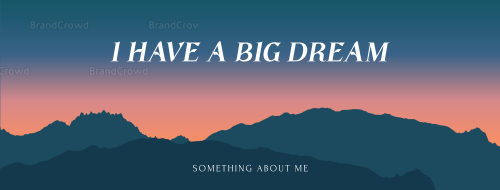

<!-- https://docs.github.com/en/get-started/writing-on-github/getting-started-with-writing-and-formatting-on-github/basic-writing-and-formatting-syntax -->

 </a>

# About me! 👋⛏

- Like many other young people, is an enthusiastic person who loves to learn new things to learn, self-study and self-improvement.

- A person who is able to withstand pressure, good time management, knows how to prioritize important work assigned.

- Is a reliable friend, good communicator, and ready to help/share accumulated knowledge to teammates in any situation.

- Always look at things in a positive light, always move forward, and always improve your skills to become the best.

- The goal in the next 5 years will be to become the mainstay of the company, the best and the best. Create high value to contribute to society

### My Hobbies

- Anime/Manga/LightNovel 🚀📚📒
- Music 🎶🎵🎼

### More info

I'm an ordinary and simple person who studied at [_Cao Thang Technical College_](https://caothang.edu.vn/).

# 🎯 Main Focus

I am currently focusing on Mobile Development.
But in the future I want to do fullstack to find the intersection of creativity 🍀

# 🌀 Skills

<!-- ### Technology -->

<!-- https://shields.io/ xem cac link o day
fast badge https://github.com/alexandresanlim/Badges4-README.md-Profile
-->

### Languages

<!--  -->

### Frameworks or Library

### Tools

# 📨 Contact me at

     
    

# 📊 GitHub Statistics

    
    

<!--  -->

    

    

    <i>"Never give up."</i>

